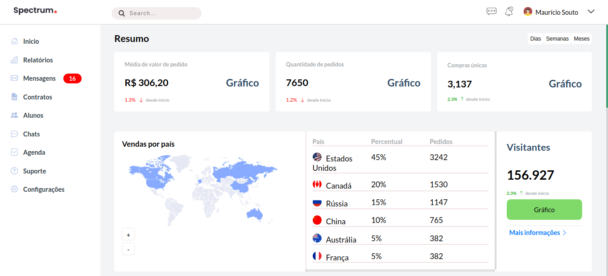

#### Project Dashboard Responsive

+ Projeto utilizado apenas com css grid

+ Botão mobile menu responsivo

+ Tabela responsiva 

+ Scrool em áreas que diminuir o tamanho da grid não fica legal, como o mapa por exemplo

+ Efeitos sobre menu de transição de cores

 <h1 align="center">Tela Principal - Desktop</h1>

 

  
 
