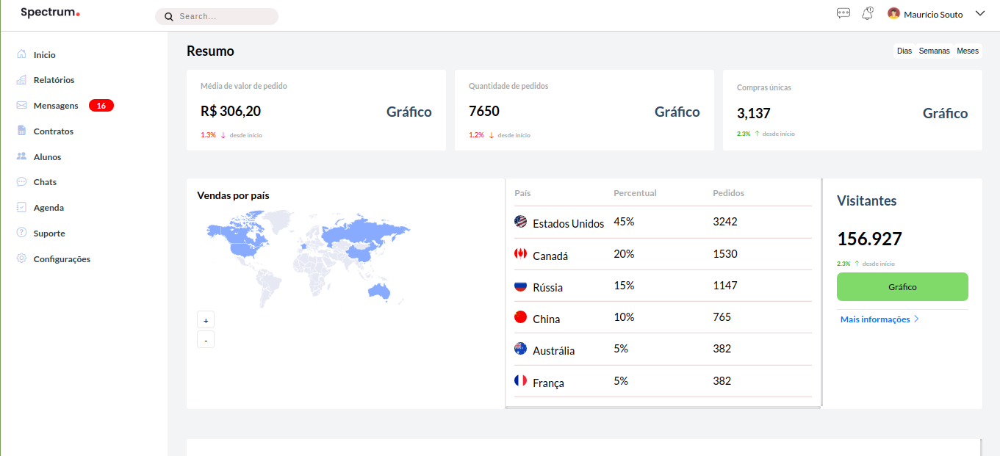
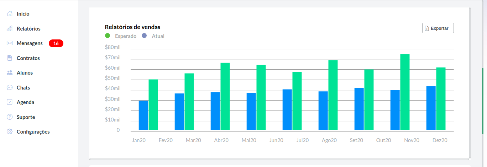
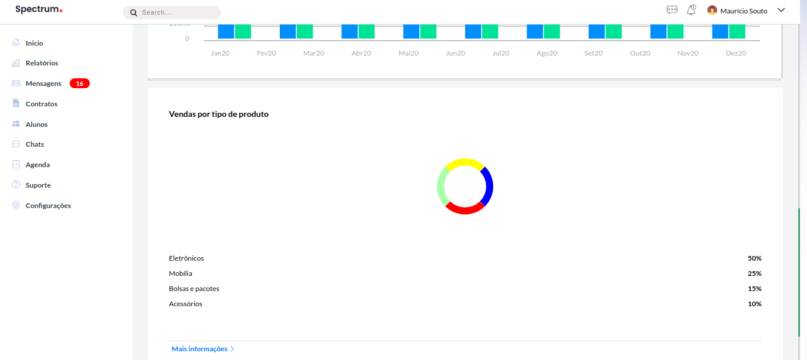
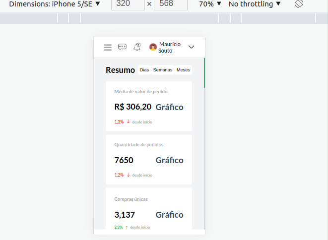

#### Project Dashboard Responsive

+ Projeto utilizado apenas com css grid

+ Botão mobile menu responsivo

+ Tabela responsiva 

+ Scrool em áreas que diminuir o tamanho da grid não fica legal, como o mapa por exemplo

+ Efeitos sobre menu de transição de cores

*OBS:* _"Ainda necessita de pequenos ajustes :) Se quiser contribuir fica a vontade"_

 <h1 align="center">Tela Principal - Desktop</h1>

 

  
 

  <h1 align="center">Tela Principal - secundária gráfico</h1>

 

  
 

  <h1 align="center">Tela Principal - secundária gráfico circle</h1>

 

  
 

   <h1 align="center">Versão Mobile em uma das menores telas do mercado (Iphone 5/SE 320 x 568)</h1>

 

  
 

